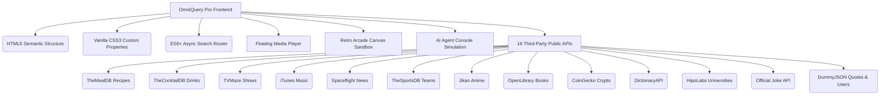

# 🍳 OmniQuery Pro - Unified Discovery Engine & AI Agent Workspace

OmniQuery Pro is a premium, glassmorphic search dashboard that merges **16 distinct discovery channels** into a single frontend hub. It features live queries to public APIs (Recipes, Cocktails, Movies, Music, News, Sports, Anime, Books, Crypto, Dictionary, Universities, Jokes, Quotes, and Developers), a retro arcade mini-game sandbox, and an interactive AI Agent console with live terminal command streaming.

---

## ✨ Premium Features

- 🎨 **Glassmorphism Design**: High-fidelity dark mode utilizing backdrop filters, glowing HSL colors, smooth transitions, and animated loaders.
- 🔗 **API ID Badges**: Each search result displays its unique ID tag prominently, reflecting system record tracking.
- 🎵 **Floating Audio Player**: Integrates iTunes track previews with real-time audio playback controls and a scrubbing progress bar.
- 🎮 **Retro Arcade Sandbox**: Canvas-based Snake Game embedded directly within the Online Gaming channel.
- 🤖 **AI Agent Workspace**: Interactive terminal shell where users can issue tasks to simulated AI Agents (Antigravity, AutoGPT, Claude Engineer, Devika) and view streaming execution logs.
- 📱 **Fully Responsive Layout**: Intuitive sidebar navigation collapses to a horizontal scrollbar on tablet/mobile screens.
- 🔍 **Instant Search Engine**: Debounced search bar with clear button, category header descriptions, stats counters, and endpoint tracking.

---

## 🛠️ Tech Stack

---

## 📂 Project File Structure

- **[index.htm](file:///d:/Githube/New%20folder/recipe-finder-pro-/index.htm)**: Structural markup defining the dashboard shell, sidebar channels list, search input wrapper, statistics header, results cards grids, floating media players, game canvas, and terminal emulator panels.
- **[style.css](file:///d:/Githube/New%20folder/recipe-finder-pro-/style.css)**: Implements custom HSL properties, glassmorphism classes (`backdrop-filter`), grid layouts, slide-in layouts, animations (skeleton pulse, orange and green pulses), scrollbar themes, and responsive design media queries.
- **[script.js](file:///d:/Githube/New%20folder/recipe-finder-pro-/script.js)**: Handles query actions, fetches live endpoints, renders dynamic category cards, handles HTML5 audio events, updates canvas game graphics, and controls terminal log simulation streams.
- **[note.txt](file:///d:/Githube/New%20folder/recipe-finder-pro-/note.txt)**: Reference guide with integrated API links, features overview, and developer logs.

---

## 📡 API Channel Index

| Channel Name | API Provider | Endpoint Pattern / Format | Primary Fields Captured | Unique Features |
| :--- | :--- | :--- | :--- | :--- |
| **Recipes** | TheMealDB | `https://www.themealdb.com/api/json/v1/1/search.php?s={q}` | `strMeal`, `strMealThumb`, `strInstructions`, `strCategory`, `strArea`, `idMeal` | Ingredients parser list, detail modal popup |
| **Cocktails** | TheCocktailDB | `https://www.thecocktaildb.com/api/json/v1/1/search.php?s={q}` | `strDrink`, `strDrinkThumb`, `strInstructions`, `strGlass`, `strAlcoholic`, `idDrink` | Beverage specs list, detail modal popup |
| **Movies & TV** | TVMaze | `https://api.tvmaze.com/search/shows?q={q}` | `name`, `image.medium`, `summary`, `genres`, `rating.average`, `id` | Star rating display, direct website redirection |
| **Music & Tracks**| iTunes Search | `https://itunes.apple.com/search?entity=song&term={q}` | `trackName`, `artistName`, `artworkUrl100`, `previewUrl`, `trackId`, `collectionName` | Floating player connection, audio streaming |
| **Latest News** | Spaceflight News| `https://api.spaceflightnewsapi.net/v4/articles/?search={q}` | `title`, `image_url`, `summary`, `news_site`, `url`, `id` | News publisher tags, source article redirection |
| **Sports & Teams**| TheSportsDB | `https://www.thesportsdb.com/api/v1/json/3/searchteams.php?t={q}` | `strTeam`, `strTeamBadge`, `strLeague`, `strSport`, `strDescriptionEN`, `idTeam` | Team logo display, venue specs, official links |
| **Online Gaming** | Local Sandbox | Static Catalog & Custom Query Filter | `title`, `genre`, `developer`, `rating`, `platform`, `image`, `id` | Playable game inline trigger, developer specs |
| **Anime Hub** | Jikan API | `https://api.jikan.moe/v4/anime?q={q}` | `title`, `images.jpg.image_url`, `synopsis`, `score`, `episodes`, `mal_id` | Anime rating tags, rank details, background modals |
| **Books & Lit** | OpenLibrary | `https://openlibrary.org/search.json?q={q}` | `title`, `author_name`, `first_publish_year`, `cover_i`, `key` | Cover image reconstruction, publisher metrics |
| **AI Agents** | Local Sandbox | Interactive Agent Registry & Console Logs | `name`, `developer`, `version`, `status`, `capabilities`, `description`, `id` | Run simulated tasks, terminal streams |
| **Crypto Coins** | CoinGecko | `https://api.coingecko.com/api/v3/search?query={q}` | `name`, `large`, `symbol`, `market_cap_rank`, `id` | Token symbol tracker, market rank inspection |
| **Dictionary** | DictionaryAPI | `https://api.dictionaryapi.dev/api/v2/entries/en/{q}` | `word`, `phonetic`, `meanings.definitions`, `meanings.partOfSpeech` | Parts of speech categories, phonetic audios |
| **Universities** | HipoLabs | `http://universities.hipolabs.com/search?name={q}` | `name`, `country`, `domains`, `web_pages` | Global country filters, official web pages links |
| **Jokes Finder** | Official Joke | `https://official-joke-api.appspot.com/jokes/search?term={q}` | `setup`, `punchline`, `type`, `id` | Interactive punchline reveal details |
| **Famous Quotes** | DummyJSON | `https://dummyjson.com/quotes/search?q={q}` | `quote`, `author`, `id` | Citation card formatting |
| **Developer Cards**| DummyJSON | `https://dummyjson.com/users/search?q={q}` | `firstName`, `lastName`, `image`, `company.title`, `email`, `id` | Profile card layout, click to email, specs |

---

## 🕹️ Interactive Subsystems

### 1. Retro Snake Arcade Canvas
- Implemented within a `<canvas>` window running grid dimensions of `400px` x `400px`.
- Navigation mapped using browser event listeners capturing `Arrow Keys` and standard gaming key configurations `W, A, S, D`.
- Uses `localStorage` persistence tracking to preserve the global High Score.
- Collisions calculated against canvas borders and overlapping tail nodes, yielding a custom game-over modal screen.

### 2. AI Workspace Terminal Emulator
- Terminal console built inside the AI Agent dashboard view.
- Provides interactive run loops streaming logs simulating developer workflows:
  - Phase 1: Objective parsing
  - Phase 2: Indexation mapping and repository scanning
  - Phase 3: Validation test compilation
  - Phase 4: Clean exit results summaries
- Status tags in sidebar indicators switch from `idle` to `thinking` / `running` dynamically.

### 3. Floating Player Console
- Positioned floating at the bottom right corner with a slide-up transition overlay.
- Houses play/pause, next track, and previous track buttons, tracking play states globally.
- Features dynamic time scrubbers tracking current playback progress against track lengths.

---

## 🚀 Getting Started & Installation

1. Clone or download the repository files.
2. Double-click [index.htm](file:///d:/Githube/New%20folder/recipe-finder-pro-/index.htm) to open the application directly in any web browser.
3. Select any search channel from the sidebar, input queries, and explore live metadata records.

---

## 📢 Social Media Promotion Campaign

### LinkedIn Post (Professional & Technical)
> **🚀 Just Launched OmniQuery Pro - The Ultimate Unified Search Dashboard & AI Agent Workspace!**
> 
> I have completely redesigned my recipe application into a premium, glassmorphic discovery center powered by **16 public third-party APIs** (Recipes, Cocktails, Movies, Music, News, Sports, Anime, Books, Cryptocurrencies, and more).
> 
> **Key Core Features Implemented:**
> ✅ **Multi-API Search Routing**: Dynamically maps search input queries to separate API structures with automatic skeleton-state loaders.
> ✅ **ID Tracking Badges**: Unique database identifiers (`idMeal`, `idDrink`, `trackId`, `mal_id`) are displayed prominently on cards and details screens.
> ✅ **Interactive Sandbox Modules**: Includes an inline floating audio player with iTunes track previews, a retro Canvas-based Snake Arcade game, and a simulated CLI terminal console streaming live AI agent update records.
> ✅ **Glassmorphic Styling System**: Crafted using vanilla HTML5 and CSS3 (Tailwind-free), utilizing HSL gradients, backdrop-blur filters, and custom keyframe animations.
> 
> **Tech Stack:**
> ▫️ Pure JavaScript (ES6+ Async/Await)
> ▫️ CSS Grid / Flexbox Layouts
> ▫️ 16 Public Keyless REST APIs
> 
> Check out the codebase: [GitHub Link]
> 
> #JavaScript #FrontendDev #WebDesign #APIIntegration #CSSGlassmorphism #CodingPortfolio #WebDevelopment #UXDesign #ArcadeSandbox #AIAgents

---

### Instagram Post (Visual Appeal)
> **✨ Swipe → Discover OMNIQUERY PRO!**
> 
> I’ve transformed a basic recipe app into a futuristic glassmorphic dashboard! 🌌
> 
> 🔥 **What's New:**
> • 🖥️ Glassmorphism UI with neon purple & cyan gradients.
> • 📡 16 search channels (Movies, News, Books, Sports, Cocktails, etc.).
> • 🎵 Floating iTunes music player.
> • 🎮 Playable retro Snake game inline!
> • 🤖 AI Agent Console with streaming CLI terminal logs.
> 
> Built completely with:
> 💻 Vanilla JS (No heavy frameworks!)
> 🎨 Flexbox, CSS Variables & Backdrop Blur
> 🔗 Live API integrations with unique ID tracking badges
> 
> **GitHub link in bio!** 👨‍💻
> 
> #JavaScript #WebDev #DarkMode #OmniQueryPro #Coding #Frontend #Developer #CSS #HTML #WebDesign #UIDesign #API #NoFrameworks #ArcadeDev #CodeLife #BuildInPublic #100DaysOfCode

---

### Twitter/X Thread
> **1/4: 🚀 Just launched OmniQuery Pro v2!**  
> 
> A complete UI/UX overhaul transitioning a simple recipe app into a unified search center & AI agent simulator console dashboard.  
> 
> Live code: [Link] #WebDev #Frontend
> 
> **2/4: Under the hood:**  
> • Built with pure vanilla CSS3 and ES6+ JavaScript.  
> • Connects to 16 public APIs (TVMaze, iTunes, Jikan, CoinGecko, Spaceflight News, and more).  
> • Every element is fully responsive with glassmorphic cards and skeleton loaders. #NoFrameworks
> 
> **3/4: Key modules I'm proud of:**  
> 📺 Embedded canvas Snake Game with score storage.  
> 🎙️ Floating audio player with active timeline scrubbing.  
> 🤖 AI Workspace simulator console printing streaming CLI logs.  
> 🏷️ Direct database ID badges shown on all items. #JavaScript
> 
> **4/4: Lessons learned:**  
> 📌 Handling rate-limiting across 16 channels.  
> 📌 HTML5 Canvas pixel grids and key event listeners.  
> 📌 Advanced audio streaming event management.  
> 
> Check out the repo and let me know your thoughts! [GitHub Link] #100DaysOfCode

---

### Hashtag Strategy

- **Primary Tech Tags:** `#JavaScript #WebDev #Frontend #APIIntegration #CSS`
- **UI/UX Focus:** `#DarkMode #WebDesign #UIDesign #ResponsiveDesign #Glassmorphism`
- **Community Tags:** `#BuildInPublic #CodeNewbie #100DaysOfCode #DevCommunity`
- **Niche Tags:** `#OmniQueryPro #ArcadeSandbox #AIAgents #InteractiveWeb`
- **Bonus Trend Tags:** `#Developer #Coding #Programming #Tech #OpenSource`

---

### Key Differentiators to Highlight
1. **Performance**: Zero heavy framework overhead (Fast load times).
2. **Category Width**: 16 separate search channels queried via structured routers.
3. **Double Sandbox System**: Seamless switching between the Retro Arcade game and the AI Agent logs terminal.
4. **Clean ID Tracking**: Direct extraction of item IDs displayed in highlighted tags.
